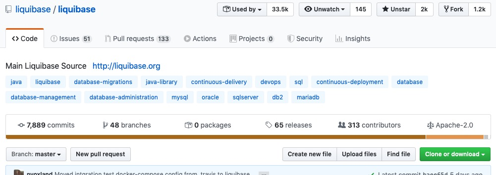

# Development Environment Setup

## Fork and Clone the Repository

[github.com/liquibase/liquibase](https://github.com/liquibase/liquibase){:target="_blank"} is the main repository for the Liquibase code.

To be able to eventually contribute changes to the project, you must first create a fork of that repository.

### 1. Browse to the [Liquibase project in GitHub](https://github.com/liquibase/liquibase){:target="_blank"} 



### 2. Click on the Fork button in the top-right corner

This creates a new copy of Liquibase under your GitHub user account with a URL like `https://github.com/<YourUserName>/liquibase`
and includes all the code, branches, and commits from the original repo.


### 3. Clone the repository

Clone the source repo to your local system by opening the terminal on your computer and running the command:

```bash
git clone https://github.com/<YourUserName>/liquibase
```

### 4. Create a branch

Create a new branch by issuing the command:

```bash
git checkout -b <new_branch>
```

Each new block of changes that belong in a pull request will need their own branch. 


## Minimal Setup

After forking and cloning the Liquibase code, you can set up your development environment. 

### 1. [Install Java](https://adoptium.net/)

Any version or distribution of Java will work, but the current LTS version is usually best. 

### 2. [Install Maven](https://maven.apache.org/download.cgi)

Unzip the archive to a directory on your system. This provides the `mvn` CLI. 

This is technically an optional step if you'll eventually use an IDE since most have Maven support built in. 
But installing it separately allows you to better duplicate the minimal build process if troubleshooting your IDE setup.   

### 3. Check Setup
 
Run `mvn clean install` which compiles Liquibase, runs the tests, and creates the jar/tar.gz packages.

You can tell the build worked successfully, if you see something like:

```
[INFO] ------------------------------------------------------------------------
[INFO] BUILD SUCCESS
[INFO] ------------------------------------------------------------------------
[INFO] Total time:  24.344 s
[INFO] Finished at: 2023-01-18T14:37:24-06:00
[INFO] ------------------------------------------------------------------------
```

at the end of the output.

It's always good to ensure you can successfully run the CLI from the current master branch before making changes locally.


## Running Builds

Running `mvn clean install` will build your local code and package the CLI archive as `liquibase-dist/target/liquibase-0-SNAPSHOT.tar.gz`.

### Running the CLI

Untarring this file will get you a complete "liquibase home" directory which you can use like any other release distribution for running your local code.

!!!tip

    Windows users can use [7-Zip](https://www.7-zip.org/){:target="_blank"} to extract the `liquibase-0-SNAPSHOT.tar.gz` file.

### Running Maven Dependency or Plugin

`mvn clean install` will also install both `liquibase-core` and `liquibase-maven-plugin` to your local Maven cache as version `0-SNAPSHOT` which allows you to use your newly built version as a project dependency or plugin.
To use it in a test project, update the reference to use `<version>0-SNAPSHOT</version>` like:

```xml
<dependency>
    <groupId>org.liquibase</groupId>
    <artifactId>liquibase-maven-plugin</artifactId>
    <version>0-SNAPSHOT</version>
</dependency>
```

or

```xml
<plugin>
    <groupId>org.liquibase</groupId>
    <artifactId>liquibase-maven-plugin</artifactId>
    <version>0-SNAPSHOT</version>
    <!-- ... additional settings ... -->
</plugin>
```

## IDE Setup

The "Minimal Setup" section builds and tests your local branch, but generally you will want to use and IDE like [VS Code](https://code.visualstudio.com/),
[IntelliJ IDEA](https://www.jetbrains.com/idea/), or your own favorite environment.

### Project Configuration

Both IDEs allow you to import the `pom.xml` file in the base of the repository as your "project". This keeps the libraries and build logic the IDE uses in sync with
what is defined in the canonical pom.xml that Maven and the CI process uses.

### Running the CLI In your IDE

The maven-built package listed above works, but it's not the most efficient way of working. The build process takes a while, and it's difficult to enable debug support.
Instead, when using an IDE with more "native" support for running classes, you can run the CLI class more directly.

Exactly how you configure your IDE to run the CLI depend on the IDE version you are using, but the general process is to create a new "Run Configuration" with the following settings:

- **Class to run:** `liquibase.integration.commandline.LiquibaseLauncher`
- **Module Classpath:** `liquibase-cli`
- **Environment Variable:** `LIQUIBASE_HOME=<PATH_TO_A_LIQUIBASE_HOME>`
- **Environment Variable:** `LIQUIBASE_LAUNCHER_PARENT_CLASSLOADER=thread`
- **Working Directory:** `<PATH_TO_A_LIQUIBASE_HOME>`
- **Program Arguments:** Whatever you are looking to test

Both the LIQUIBASE_HOME and working directory should be set to a directory where you installed a previous version of Liquibase as a starting point.
When Liquibase runs, it will use the jars in `lib` and `internal/lib` so you can add any needed drivers or extensions to those directories like you would
in a production build.

!!! note
    The `LIQUIBASE_LAUNCHER_PARENT_CLASSLOADER=thread` environment variable tells Liquibase to use the "liquibase-core.jar" from your project NOT the one in `internal/lib`.

Your run configuration should allow you to successfully run Liquibase in either regular mode or debug mode.

## Next Steps

Now that your local environment is set up, you can start making the changes you would like. 

For more information, see:

- [Working with the code](working-with-the-code.md)
- [Good First Issues](first-issues.md)
- [Create a Pull Request](create-pr.md)