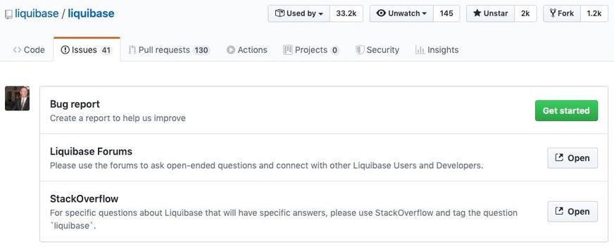

# How to report an issue in Liquibase

Liquibase Core is the main library for the Liquibase community. 

If you have a question about using the liquibase, please ask on the [Liquibase Forum](http://forum.liquibase.org/){:target="_blank"}, or in the [Liquibase Discord](https://discord.gg/pDB5DfE){:target="_blank"}.

If you think you have found a bug, or have a new feature idea, please start by making sure it hasn't already been [reported](https://github.com/liquibase/liquibase/issues?utf8=%E2%9C%93&q=is%3Aissue){:target="_blank"}. 
You can search through existing issues to see if there is a similar one reported. Include closed issues as it may have been closed with a solution.

_**Note:** Liquibase previously used [Liquibase Core Jira Issues](https://liquibase.jira.com/browse/CORE){:target="_blank"}. We will maintain both sets of issues until we have been able to fix them or move them to the new GitHub Issues location. You can still comment on issues there, but no new issues can be created._

## Step-by-step instructions

**1 –** Navigate to the [create a new issue](https://github.com/liquibase/liquibase/issues/new/choose){:target="_blank"} page.

**2 –** Click the `Get started` button next to "Bug Report or Feature request".

**3 –** Fill out the bug report template.

**4 –** Receive updates on your issue.

